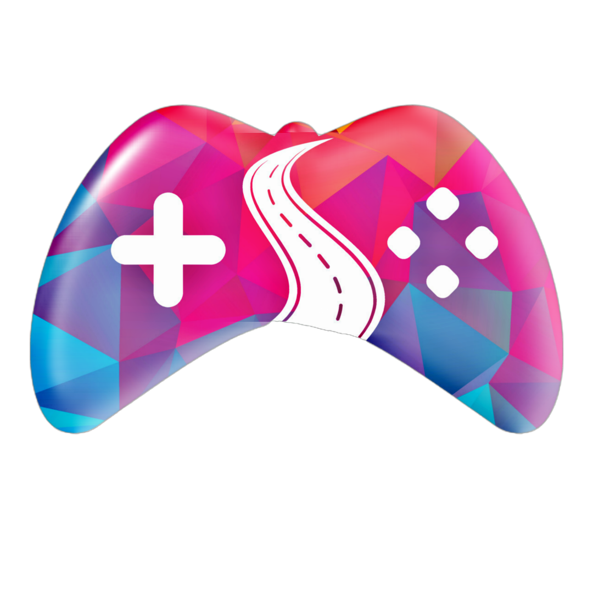

  
                                                                                           

   
  

  <h1 align="center">🏎 Cross Road Game 🎮</h1>
  
   <a href="https://cross-road-game.vercel.app/"><strong>✦ Play the Game 🏎️💨</strong></a>  
  
  ` Welcome to the Cross Road Car Game! In this thrilling game, you'll guide a car across busy roads filled with obstacles, testing your reflexes and strategic thinking. Get ready to experience endless fun and challenges! `

<h2 align="center">Game Features 🌟</h2>

- **Simple Controls:** Easy-to-use keyboard controls for intuitive gameplay.
- **Dynamic Difficulty:** Roads with varying speeds and traffic, making each level increasingly challenging.
- **Endless Fun:** The game continues until you crash, so challenge yourself to beat your high score!
- **Responsive Design:** Enjoy a seamless experience on both desktop and mobile devices.
- **Music and Sound:** Enjoy a musical and smooth sound that makes your game experience better.

<h2 align="center">Functionalities ⚙️</h2>

- **Keyboard Controls:** Use arrow keys to move the car up, down, left, or right.
- **Randomized Traffic:** Cars, trucks, and other obstacles appear at random intervals and speeds.
- **Score Tracking:** Your score increases with every successful road crossed.
- **Game Over Detection:** The game ends when your car collides with an obstacle.

<h2 align="center">🏎️💨 How to Play 🎮</h2>

1. **Start the Game:** Click on the play button or press `Enter` to begin.
2. **Move the Car:** Use the arrow keys on your keyboard to move the car in the desired direction.
   - **Up Arrow (↑):** Move forward
   - **Down Arrow (↓):** Move backward
   - **Left Arrow (←):** Move left
   - **Right Arrow (→):** Move right
3. **Cross the Roads:** Navigate through the traffic and try to cross as many roads as possible without crashing.
4. **Score Points:** Each successful crossing adds points to your score.
5. **Avoid Obstacles:** Dodge cars, trucks, and other road hazards that come your way.

<h2 align="center">Game Rules 🚨</h2>

- **Stay on the Road:** Keep your car on the road to avoid penalties.
- **Avoid Collisions:** If your car collides with another vehicle or obstacle, the game will end.
- **Increase Your Score:** The more roads you cross, the higher your score.
- **Speed Up:** As you progress, the speed and frequency of the obstacles will increase, adding to the challenge.

` Enjoy the Game! `

We hope you have fun playing the Classic Cross Road Game. If you have any feedback or suggestions, feel free to share them with us. Happy Gaming!

`Don't forget to give A star to this repository ⭐`

`👍🏻 All Set! 💌`

